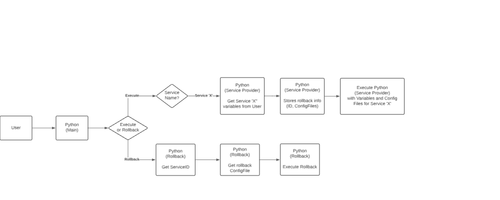

# Network Automation using Nornir/Netmiko

## Project Goals

1. Use Python (Nornir/Netmiko) as the main service provider and rollback executor.
2. Use Config Files as the services skeletons.
3. Use MySQL to store services informations (IDs, Name, RollbackConfigFile) [Future]
4. Use Docker to split the services. [Future]
5. Insert a way to configure via RESTCONF (Damn GNS3 that don't run IOS XE images lol) [Future]
6. Create a WebUI for the project [Future]

### Diagram

## Libs

1. nornir
2. nornir-netmiko